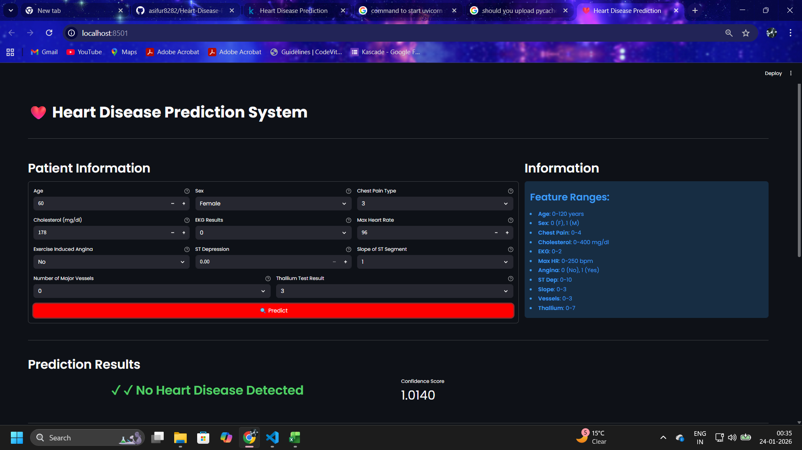
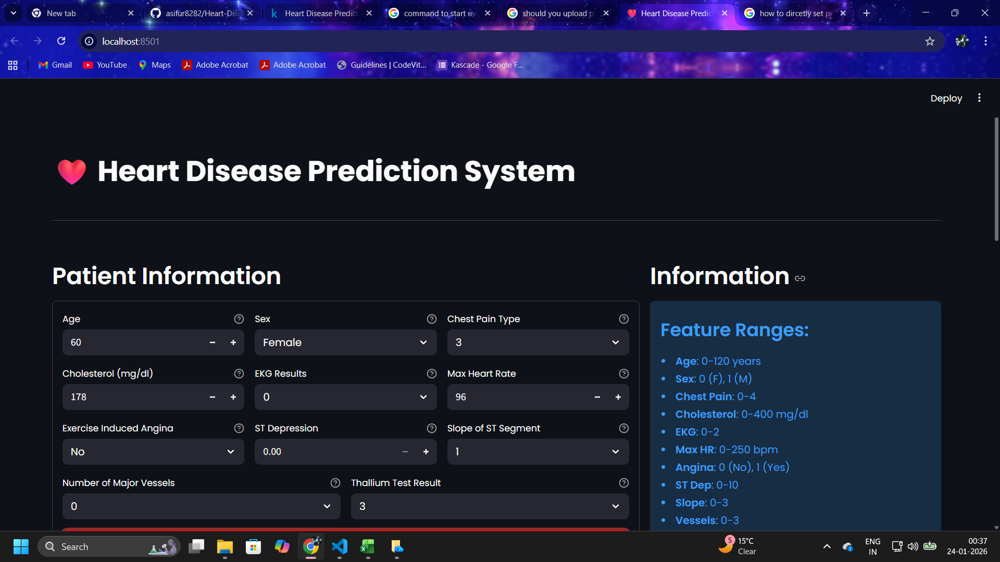
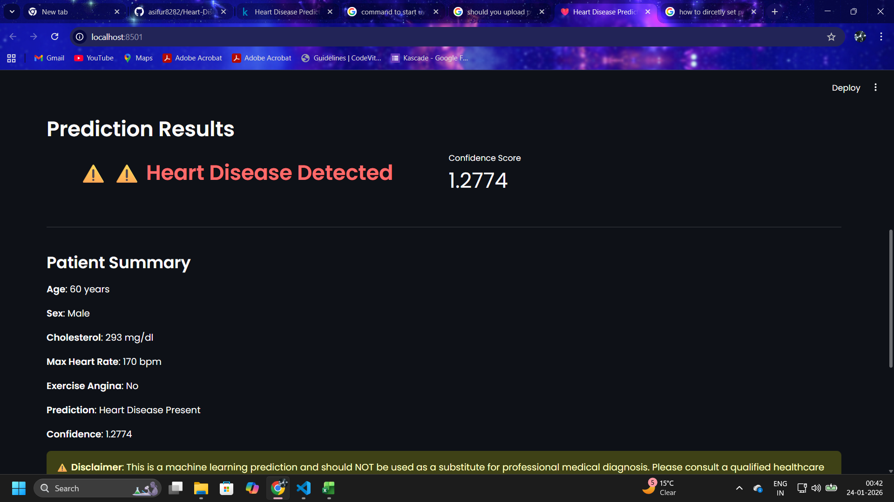
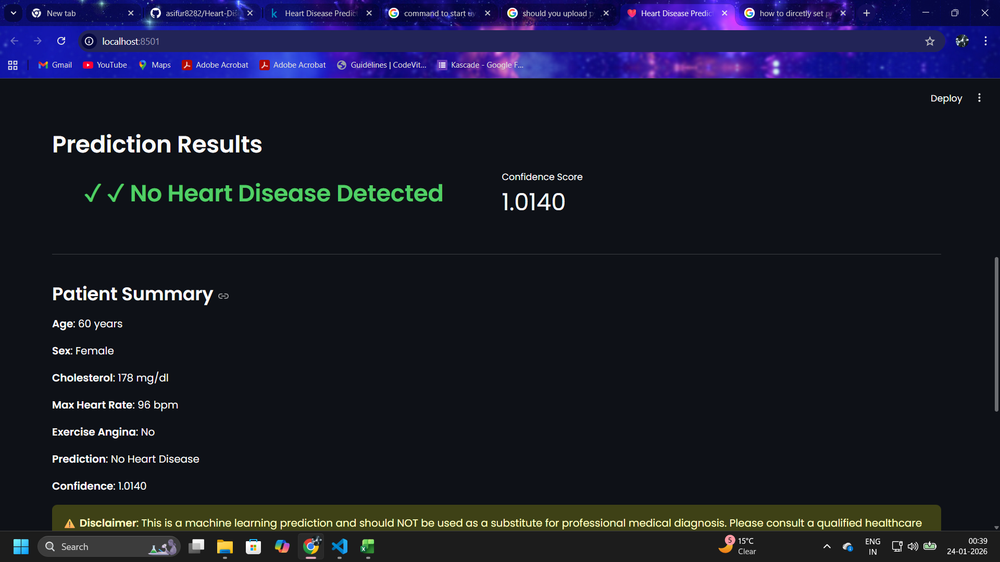

# ❤️ Heart Disease Prediction System

A comprehensive machine learning project demonstrating data cleaning, model training, and deployment using Python, Streamlit, and FastAPI.

## 📋 Purpose

This repository showcases a complete end-to-end machine learning workflow:

- **Data Cleaning**: Remove outliers, handle missing values, and feature engineering using open-source Kaggle datasets
- **Model Training**: Test 4 different ML algorithms (Logistic Regression, KNN, SVM, Random Forest)
- **Best Model Selection**: SVM achieved ~91% test accuracy and was selected for production
- **Deployment**: Interactive web application using Streamlit frontend with FastAPI backend
- **Learning Focus**: Practical implementation of data science concepts and ML pipeline

## 📊 Dataset

**Source**: [Heart Disease Prediction - Kaggle](https://www.kaggle.com/datasets/rishidamarla/heart-disease-prediction)

The dataset contains medical data for heart disease prediction with 11 clinical features and target variable indicating presence or absence of heart disease.

## 🛠️ Tech Stack

- **Data Processing**: NumPy, Pandas, Scikit-learn
- **Visualization**: Matplotlib
- **ML Models**: Scikit-learn (SVM, Logistic Regression, KNN, Random Forest)
- **Backend API**: FastAPI, Uvicorn
- **Frontend**: Streamlit
- **Containerization**: Docker

## 📊 Tags

`data-science` `scikit-learn` `data-visualization` `data-analysis` `support-vector-machines` `scikit-learn-machine-learning` `fastapi` `streamlit-dashboard`

---

## 🚀 Getting Started

**⚠️ Required: Python 3.14 or higher**

Choose one of three options based on your needs:

---

## **Option 1: Full Setup (With Data Cleaning)**

Best for: Learning the complete ML pipeline from scratch

### Windows

```powershell
# Verify Python 3.14 is installed
python --version

# Create virtual environment
python -m venv ml_env
.\ml_env\Scripts\Activate.ps1

# Install all dependencies (Python 3.14 compatible)
pip install -r requirement_all.txt
```

### Linux/Mac

```bash
# Verify Python 3.14 is installed
python3 --version

# Create virtual environment
python3 -m venv ml_env
source ml_env/bin/activate

# Install all dependencies (Python 3.14 compatible)
pip install -r requirement_all.txt
```

### Run Data Cleaning & Model Training

```powershell
# Open Jupyter notebooks
jupyter notebook Heart_Disease_Data_Cleaning.ipynb
jupyter notebook Heart_Disease_Model_Training.ipynb
```

This will:
1. Clean the raw Kaggle dataset
2. Remove outliers and handle missing values
3. Train 4 different ML models
4. Save the best SVM model

### Run the Application

After training, run both backend and frontend:

**Terminal 1 - Backend:**
```powershell
python backend_api.py
```

**Terminal 2 - Frontend:**
```powershell
streamlit run frontend_streamlit.py
```

Access at: `http://localhost:8501`

---

## **Option 2: Production Ready (Without Docker)**

Best for: Running the trained model without data cleaning

### Windows

```powershell
# Verify Python 3.14 is installed
python --version

# Create virtual environment
python -m venv app_env
.\app_env\Scripts\Activate.ps1

# Install dependencies (Python 3.14 compatible)
pip install -r requirement_apponly.txt
```

### Linux/Mac

```bash
# Verify Python 3.14 is installed
python3 --version

# Create virtual environment
python3 -m venv app_env
source app_env/bin/activate

# Install dependencies (Python 3.14 compatible)
pip install -r requirement_apponly.txt
```

### Run Backend & Frontend

**Terminal 1 - Backend API:**
```powershell
# Windows
uvicorn backend_api:app --reload --host 127.0.0.1 --port 8000

# Linux/Mac
uvicorn backend_api:app --reload --host 127.0.0.1 --port 8000
```

**Terminal 2 - Frontend:**
```powershell
# Windows
streamlit run frontend_streamlit.py

# Linux/Mac
streamlit run frontend_streamlit.py
```

Access the application:
- **Frontend**: `http://localhost:8501`
- **Backend API**: `http://localhost:8000`

### Alternative: Direct Python Script

```powershell
# Test with direct prediction script (Windows/Linux/Mac)
python predict_heart_disease.py
```

This runs an interactive CLI to test predictions.

---

## **Option 3: Docker (Easiest)**

Best for: One-command deployment with no dependency issues

### Prerequisites
- Docker Desktop installed and running

### Build & Run

```powershell
# Build the image
docker build -t heart-disease-app .

# Run the container
docker run -p 8000:8000 -p 8501:8501 heart-disease-app
```

### Access the Application

- **Frontend**: `http://localhost:8501`
- **Backend API**: `http://localhost:8000`

### Using Docker Compose

```powershell
# Build and run with docker-compose
docker-compose up --build
```

### Stop the Container

```powershell
docker stop heart-disease-app
```

---

## 📁 Project Structure

```
Heart Disease Prediction/
├── Heart_Disease_Prediction.csv           # Raw dataset from Kaggle
├── Heart_Disease_Cleaned.csv              # Cleaned dataset (after preprocessing)
├── Heart_Disease_Data_Cleaning.ipynb      # Data cleaning & preprocessing
├── Heart_Disease_Model_Training.ipynb     # Model training & evaluation
├── backend_api.py                         # FastAPI backend
├── frontend_streamlit.py                  # Streamlit UI
├── predict_heart_disease.py               # CLI prediction script
├── svm_heart_disease_model.pkl            # Trained SVM model
├── scaler.pkl                             # Feature scaler
├── Dockerfile                             # Docker configuration
├── docker-compose.yml                     # Docker Compose config
├── start.sh                               # Container startup script
├── .dockerignore                          # Docker ignore rules
├── .gitignore                             # Git ignore rules
├── requirement_all.txt                    # All dependencies (data cleaning + app)
├── requirement_apponly.txt                # App-only dependencies
├── LICENSE                                # MIT License
├── README.md                              # Project documentation
└── images/                                # Example screenshots
```

---

## 📸 Example Usage

**Note**: Images below are  testing of the application. They show example outputs and do not represent official documentation or results.










---

## 🔄 Workflow Overview

### 1. Data Cleaning Phase
- Load raw Kaggle dataset
- Identify and remove outliers using IQR method
- Detect highly correlated features
- Select features based on correlation with target
- Save cleaned dataset

### 2. Model Training Phase
- Split data into train/validation/test sets (70/15/15)
- Train 4 different algorithms:
  - Logistic Regression
  - K-Nearest Neighbors (KNN)
  - Support Vector Machine (SVM)
  - Random Forest
- Compare accuracies
- Select SVM (best performer: ~90% accuracy)

### 3. Deployment Phase
- FastAPI backend for predictions
- Streamlit frontend for user interaction
- Docker containerization for easy deployment

---

## 💡 Features

✅ **Data Cleaning**
- Outlier removal using IQR method
- Correlation analysis
- Feature selection based on target correlation

✅ **Model Training**
- Multiple algorithm comparison
- Validation and test accuracy metrics
- Model persistence with joblib

✅ **Production Ready**
- RESTful API with FastAPI
- Interactive web interface with Streamlit
- Input validation and error handling
- Docker support for deployment

✅ **User-Friendly**
- Beautiful dark theme UI
- Real-time predictions
- Confidence scores
- Patient summary display

---

## 📊 Model Performance

| Algorithm | Validation Accuracy | Test Accuracy |
|-----------|-------------------|---------------|
| Logistic Regression | ~76% | ~88% |
| KNN | ~76% | ~85% |
| **SVM** | **~79%** | **~91%** |
| Random Forest | ~79% | ~88% |

**Selected Model**: SVM (Support Vector Machine) - Best test accuracy

---

## 📝 Input Features

The model accepts the following patient information:

- **Age**: 0-120 years
- **Sex**: 0 (Female), 1 (Male)
- **Chest Pain Type**: 0-4
- **Cholesterol**: 0-400 mg/dl
- **EKG Results**: 0-2
- **Max Heart Rate**: 0-250 bpm
- **Exercise Induced Angina**: 0 (No), 1 (Yes)
- **ST Depression**: 0-10
- **Slope of ST Segment**: 0-3
- **Number of Major Vessels**: 0-3
- **Thallium Test Result**: 0-7

---

## ⚠️ Disclaimer

This application provides predictions based on machine learning models for educational purposes. **It is NOT a substitute for professional medical diagnosis.** Always consult a qualified healthcare provider for accurate diagnosis and treatment recommendations.

---

## 📚 Learning Outcomes

This project demonstrates:

✓ End-to-end ML pipeline development
✓ Data preprocessing and cleaning techniques
✓ Model selection and comparison
✓ API development with FastAPI
✓ Web UI development with Streamlit
✓ Docker containerization
✓ Production deployment practices


## 📄 License

This project is for educational purposes.

---

## 🙋 Support

For issues or questions:
1. Check the project structure and ensure all files are present
2. Verify Python version compatibility (3.11+)
3. Ensure Docker is running (for Option 3)
4. Check that ports 8000 and 8501 are available

---

